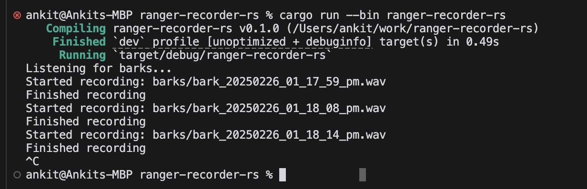
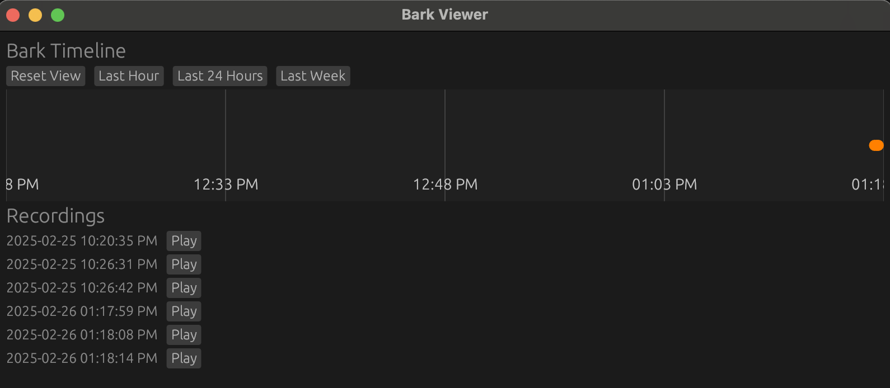
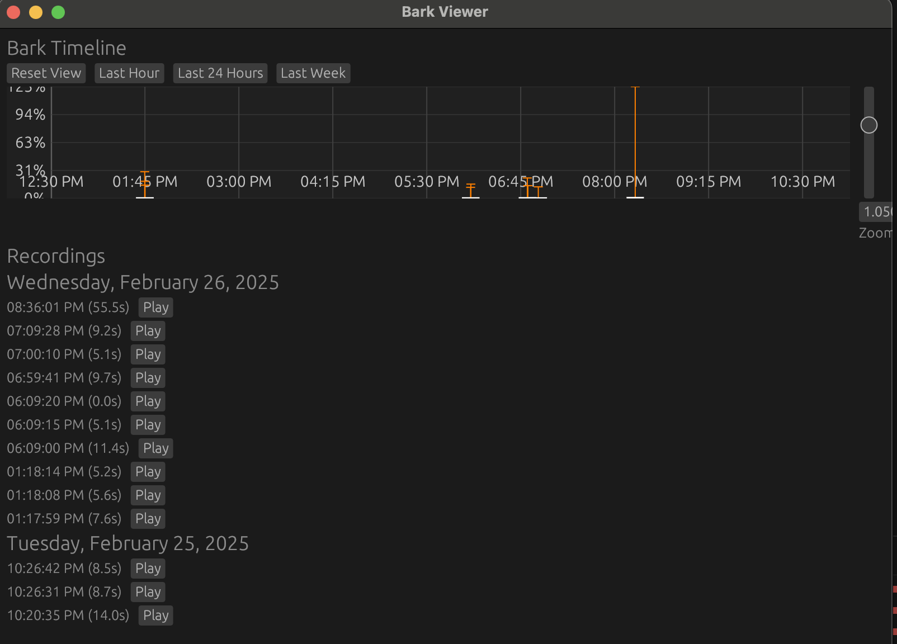

# ranger-recorder-rs

Simple app to record audio clips of your dog barking and view/listen to them over a timeline.

## Usage

To start the bark recorder:
```
cargo run
```

To start the GUI, and browse recorded audio clips:

```
cargo run --bin viewer
```

## Context

We got a letter from the city because a neighbor complained about our dog barking. We thought Ranger is generally not too bad when we leave. So, we wanted to gather data on when he's barking and how long.

I didn't want to just set up a laptop and record for many hours. Feels wasteful, and then I have a large audio file to browse through. I thought it would be nice to see a timeline of when he makes noise and how much. I didn't _immediately_ find an app online that would do that.

We prompted chatgpt first:

_I want to write a Rust program to record audio while I am out of the house so I can see when my dog barks over the course of a couple hours. I would like to record information so I can see timestamps of when barking starts, and play those sections back. Write a Rust program that will record an audio stream from input, only saving clips if the volume of the input goes above a certain threshold._

I took chatgpts output and pasted it into a new `ranger-recorder-rs`. Opened in cursor.

`cargo run` didn't work out of the box. But, a couple rounds of

_See the compilation issue. Fix main.rs_

and voila! App is recording timestamp'd clips whenever Ranger or I bark.



This version took ~5 minutes to get recording.

A little bit of refining the recorder with:

- _Save clips into barks/ directory_
- _Adjust timestamps on file so it is more human readable, like X format_
- _Print to console whenever the app starts recording a file and stops recording a file_
- _The app currently records a max of `MIN_BARK_DURATION` after the first bark above the threshold is detected. Update it so that after the initial bark is heard, any subsequent bark will reset the timer after which the recording will stop after a given duration of silence._

And things go swimmingly. 

THEN, I ask it to make a gui.

_Add a separate rust gui I can run that will load the recorded audio files and show me over a timeline when barks were recorded_

It spit out a `viewer.rs`, updated deps. Again, a couple of "See compilation issue. Fix viewer.rs". And a working GUI pops up!



_Early GUI_

I had requested some changes like - timeline on x-axis, printing timestamps alongside recordings, maybe more. It offered to add functionality to play back the audio files, and I said "yes add this functionality".

This working version took ~30 minutes end to end.

### Add-ons

Since genesisGUI++, I've since requested a couple more tweaks, like

- showing clips on the timeline graph in a box-and-whisker style, so I can see which clips are relatively louder
- adding zoom/scroll to zoom into the timeline, or scroll left and right.
- When hovering over a clip's Play button, the corresponding box-and-whisker is highlighted.


One cool thing I noticed: After a couple rounds of unsuccessful "Fix crowded axis labels [...]", feeding in a screenshot seemed to help it understand better.


_Recent GUI_

### Future work

I would like to see cool waveforms of the audio clips, to see if Ranger is howling, or barking sharply. 

Feel free to mess around with `ranger-recorder-rs` yourself!
 
